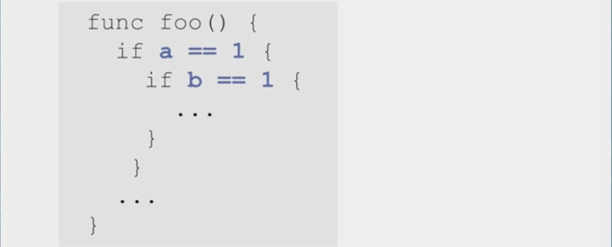
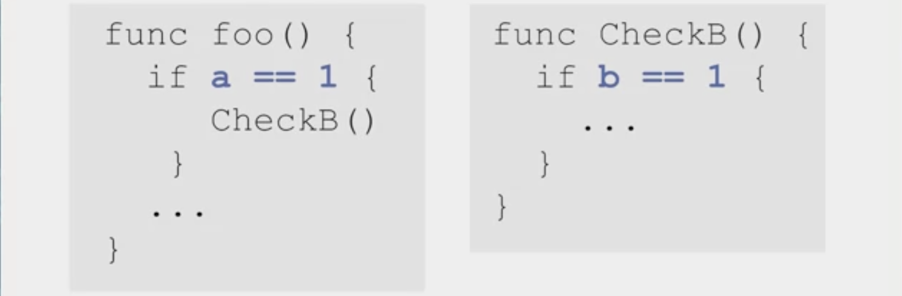

# Functions and Organization
## Why Use Functions?
### What is Functions?
- A set of instructions with a name
- ``` 
    func main () {
        fmt.Printf("Hello, world.")
    }
  ```
- ``` 
    func PrintHello () {
        fmt.Printf("Hello, world.")
    }
    func main () {
        PrintHello()
    }
  ```
- Function declaration, name, call

### Reusability
- You only need to declare a function once
- Good for commonly used operations• 
- Graphics editing program might have ```ThresholdImage ()```
- Database program might have ```QueryDbase()```
- Music program might have ```ChangeKey ()```

### Abstraction
- Details are hidden in the function
- Only need to understand operations
- Improves understandability
- ```
    func FindPupil (){
        GrabImage()
        FilterImage()
        FindEllipses()
    }
  ```
- Naming is important for clarity

### Function Parameters
- Functions may need input data to perform their operations
- **Parameters** are listed in parenthesis after function name
- **Arguments** are supplied in the call
- ```
    func foo(x int, y int) {
        fmt.Prints(x * y)
    }
    func main(){
        foo(2,3)
    }
  ```

### Parameter Options
- If no parameters are needed, put nothing in parentheses
- Still need parentheses
    - ```
      func foo(){
      }
      ```
- List arguments of same type
    - ```
        func foo(x , y int){
        }
      ```
### Return Values
- Functions can returns a value as a result
- **Type of return value** after parameters in declaration
- Function call used on right-hand side of an assignment
- ```
  func foo(x int) int {
    return x+1
  }
  y := foo(1)
  ```
### Multiple Return Values
- Multiple value types must be listed in the declaration
- ```
    func foo2(x int) (int, int){
        return x, x + 1
    }
    a, b := foo2(3)
  ```

### Call by Value, Reference
- Passed arguments are copied to parameters
- Modifying paramaeters has no effect outside the function
- ```
    func foo(y int){
        y = y + 1
    }
    func main(){
        x := 2
        foo(x)
        fmt.Print(x)
    }
  ```
### Tradeoffs of Call by Value
- **Advantage: <font color="lighblue">Data Encapsulation</font>**
- Function variables only changed inside the function
- **Disadcantage: <font color="lighblue">Copying time</font>**
- Large objects may take a long time to copy

### Call by Reference
- Programmer can pass a pointer as an argument
- Called function has direct acces to caller variable memory
- ```
    func foo(y *int) {
        *y = *y + 1
    }
    func main() {
        x := 2
        foo(&x)
        fmt.Print(x)
    }
  ```

### Tradeoffs of Call by Reference
- **Advantage: <font color="lighblue">Copying Time</font>**
- Don't need to copy arguments
- **Disadvantage: <font color="lighblue">Data Encapsulation</font>**
- Function variables may be changed in called functions

## Passing Arrays and Slices
- Array arguments are copied
- Arrays can be big, so this can be a problem
  - ```
      func  foo (x [3]int) int {
        return x[3]
      }
      func main(){
        a := [3]int{1, 2, 3}
        fmt.Print (foo(a))
      }
    ```
- Possible to pass array pointers
  - ```
      func  foo (x *[3]int) int {
        (* x)[0] = (*x)[0]+1
      }
      func main(){
        a := [3]int{1, 2, 3}
        foo(&a)
        fmt.Print (a)
      }
    ```
- Messy and unnecessary

### Pass Slices Instead
- <font color="lighblue">Slice</font> contain a pointer to the array
- Passing a slice copies the pointer
  - ```
      func  foo (sli []int) int {
        sli[0] = sli[0] + 1
      }
      func main(){
        a := [3]int{1, 2, 3}
        foo(a)
        fmt.Print (a)
      }
    ```

## Well-Written Functions
### understandability
- Code is **functions** and **data**
- If you are asked to <font color="lighblue">find a feature</font>, you can find it quickly
  - "Where is the function that blurs the image?"
  - "Where do you compute the average score?"
- If you are asked about <font color="lighblue">where data is used</font>, you know

### Debugging Principles
- Code crashes inside a function
- Two options for the cause
- 1. Function is written incorrectly
  - Sorts a slice in the wrong order
- 2. Data that the function uses is incorrect
  - Sorts slice correctly but slice has wrong elements in it

### Supporting Debugging
- Functions need to be understandable
  - Determine if actual behavior matches desired behavior
- Data needs to be traceable
  - Where did that data come from?
  - Global variables complicate this

## Guidelines of Functions
### Function Naming
- Give functions a good name
  - behavior can be understood at a glance
  - Parameter naming counts too
  - ```
        func ProcessArray (a []int)
              float {}
        func ComputeRMS (samples
              []float) float{}
    ```
- RMS = Root Mean Squre
- ```samples``` is a slice of samples of time-varing signal

### Functional Cohesion
- Function should perform <font color="lighblue">only onr "operation"</font>
- An "operation" depends on the context
- Example: Geometry application
- Good functions:
  - ```PointDist(), DrawCircle(), TriangleArea()```
- Merging behaviors makes code complicated
  - ```DrawCircle() + TriangleArea()```

### Few Parameters
- Debugging requires tracing function inout data
- More difficult with a Large number of paramaeters
- Function may have bad Functional Cohesion
- ```DrawCircle ()``` and ```TriangleArea ()``` require different arguments

### Reducing Parameter Number
- May need to group related arguments into structures
- ```TriangleArea()```, bad solution
  - 3 points needed to define triangle
  - Each point has 3 floats (in 3D)
  - Total, 9 arguments
- ```TriangleArea()```, good solution
    - ```type Point struct {x,y,z float}``

### Function Complexity
- <font color="lighblue">Function length</font> is the most obvious measure
- Functions should be simple
  - Easier to Debug
- Short functions can be complicated too

### Function length
- How do you write complicated code with simple functions?
- <font color="lighblue">Function Call Hierarchy</font>

- Option 2 is easier to Debug

### Control-flow Complexity
- Control-flow describes conditional paths
- 
- 3 Control-flow paths

### Partitioning conditionals
- Functional Hierarchy can reduce control-flow Complexity
- 
- 2 control-flow paths in each function


