# Function Types
## Firsts-Class Values
###  Functions are First-class
- Functions can be treated like other types
  - Variables can be declared with a function type
  - Can be <font color="lighblue">created dynamically </font>
  - Can be <font color="lighblue">passed as arguments </font> and <font color="lighblue">returned as values</font> 
  - Can be <font color="lighblue">stored in data structures</font>

### Variables as functions
- Declare a variable as a func
- ```
    var funcVar func(int) int
     func incFn(x int) int{
        return x + 1
     }
    func main() {
        funcVar = incFn
        fmt.Print(funcVar(1))
    }
  ```
- Function is on right-hand side, whitout()

### Functions as Arguments
- Function can be passed to another function as an argument
- 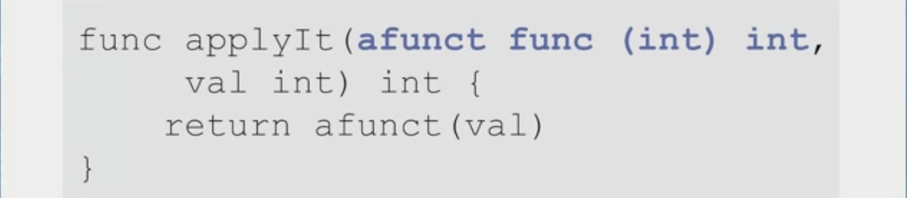
- 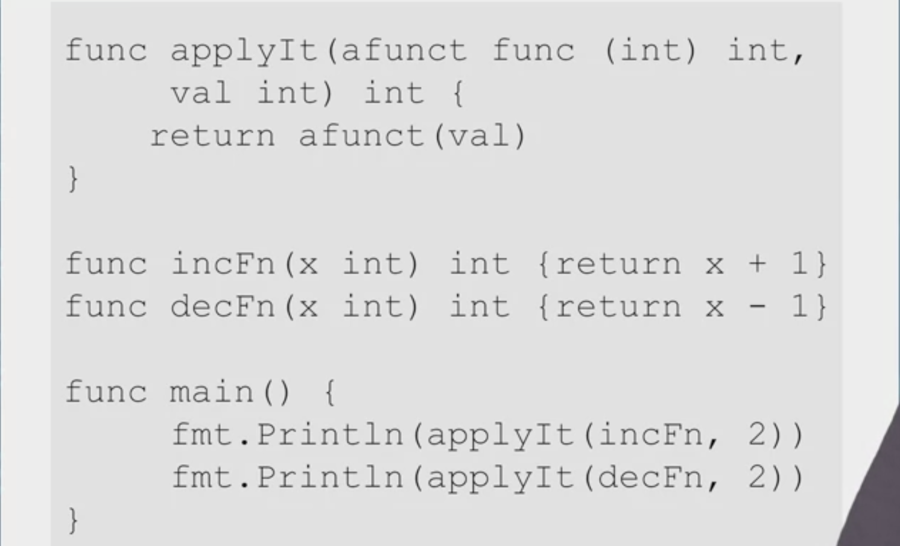

### Anonymous Functions
- Don't need to name a function
- 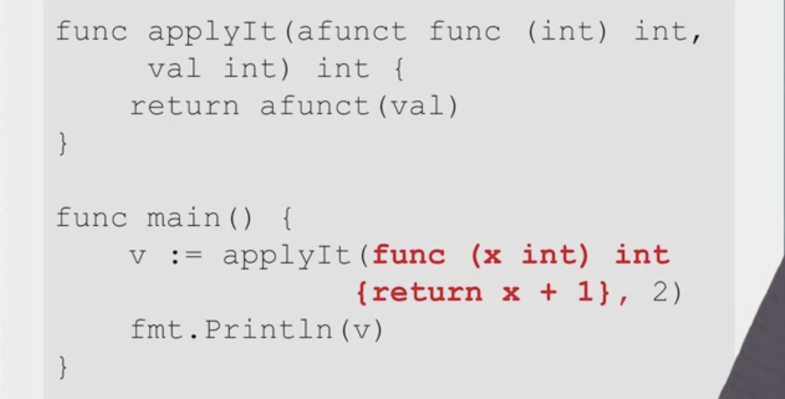

## Returning Functions
### Functions as Return Values
- Functions can return functions
- Might create a function with controllable parameters
- Example: Distance to Origin function
  - Takes a point(x,y coordinates)
  - Returns distance to origin
- What if I want to change the origin?
  - Option 1: Pass origin as argument
  - Option 2: Define function with new origin

### Function Defines a Function
- 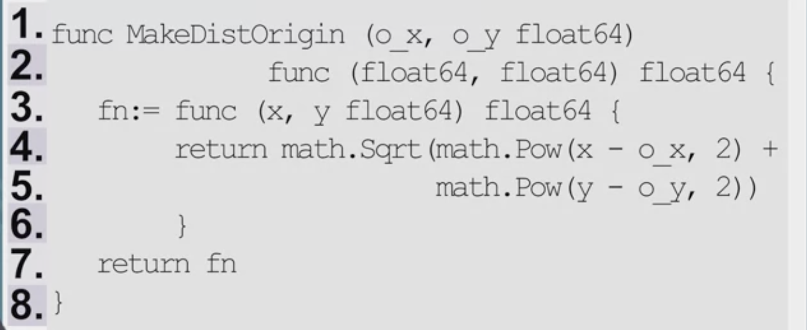
- Origin location is passed as an arguments
- Origin is built into the returned function

### Special-Purpose Functions
- 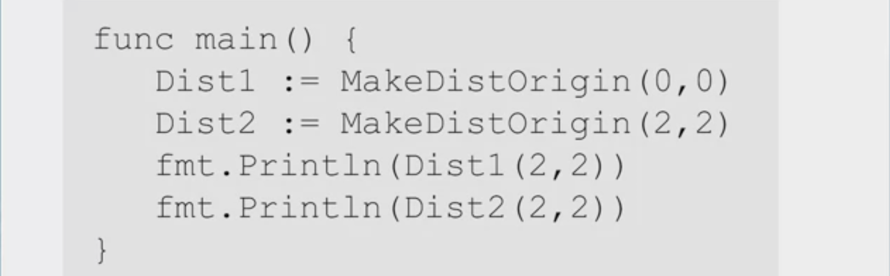
- ```Dist1()```and```Dist2()```have different origins

### Environment of a Function
- set of all names that are valid inside a function
- Names defined locally, in the function
- <font color="blue">Lexical Scoping</font>
- Environment includes names defined in block where the function is defined
- 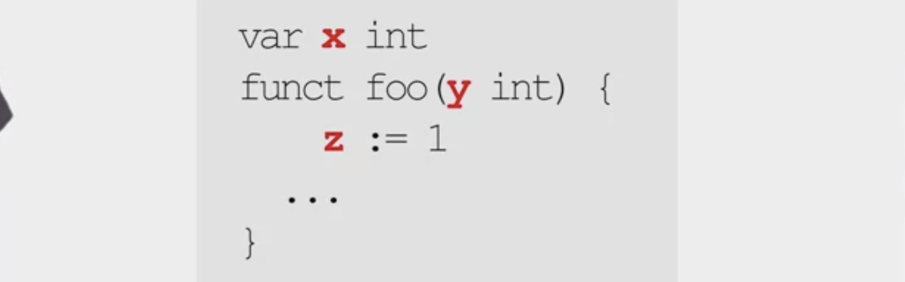

### Closure
- Function + its environment
- When functions are passed/returned, their environment comes with them!
- 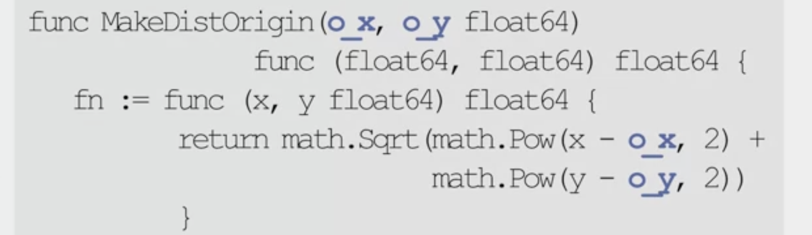
- ```o_x``` and ```o_y``` are in the closure of ```fn()```

## Variadic and Deferred
### Variable Arguments Numbers
- Functions can take a variable number of arguments
- Use ellipsis <font color="red">...</font> to specify
- Treated as a slice inside function
- 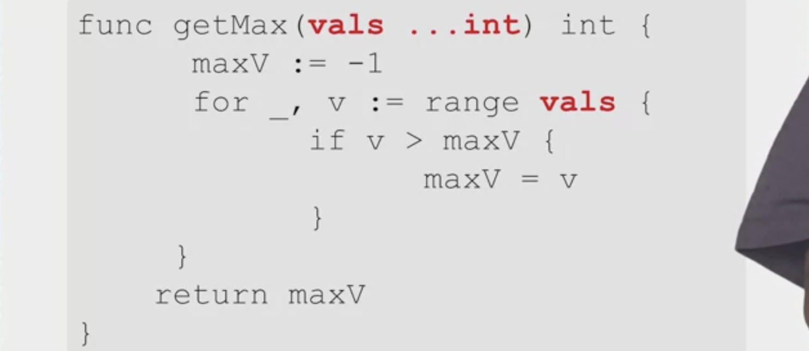

### Variadic Slice Argument
- 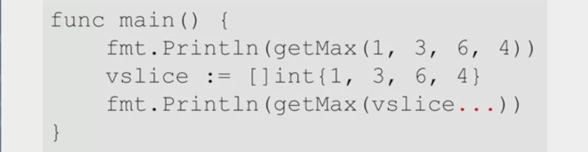
- Can pass a slice to a variadic function
- Need the <font color="red">...</font> suffix
  
### Deferred Function Calls
- Call can be <font color="lighblue">deferred</font> until the surrounding function completes
- Typically used for cleanup activities
- 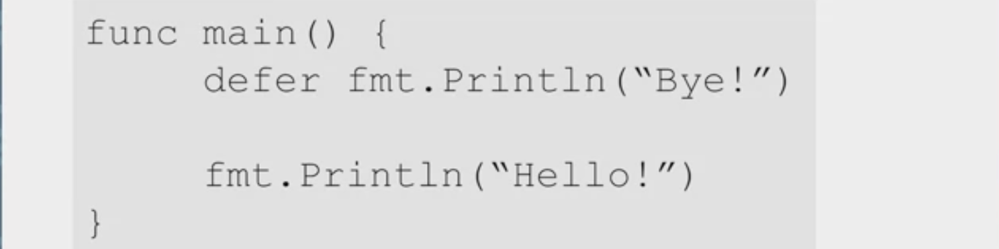

### Deferred Call Arguments
- Arguments of a deffered call are evaluated immediately
- ```
    func main(){
        i := 1
        defer fmt.Println(i+1)
        i++
        fmt.Println("Hello!")
    }
  ```
- 第一遍循环输出2，不是3，因为deferred最后执行

# Quiz
- 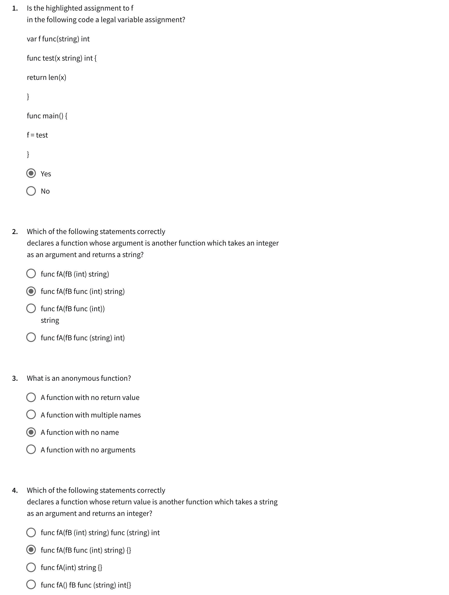
- 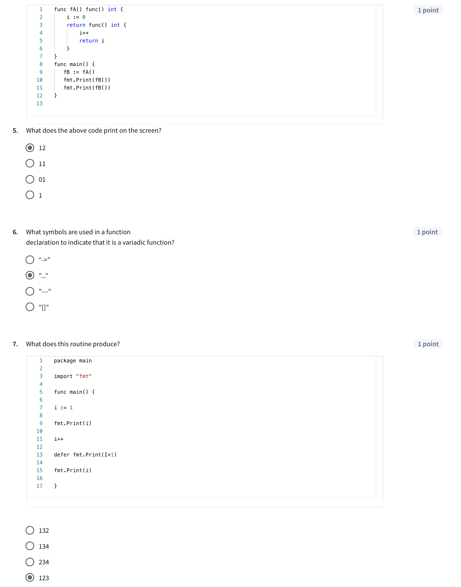