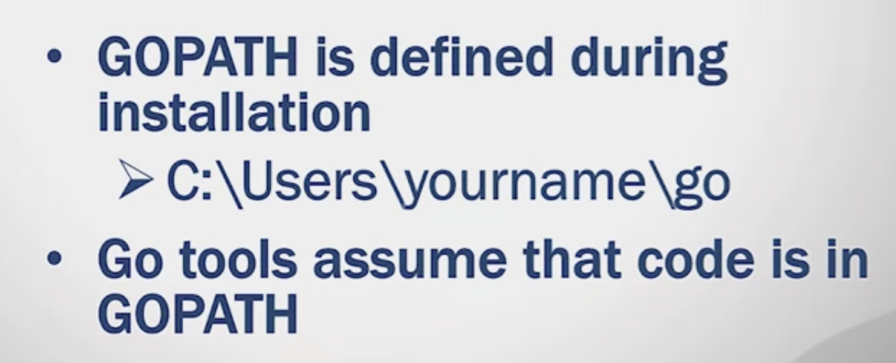
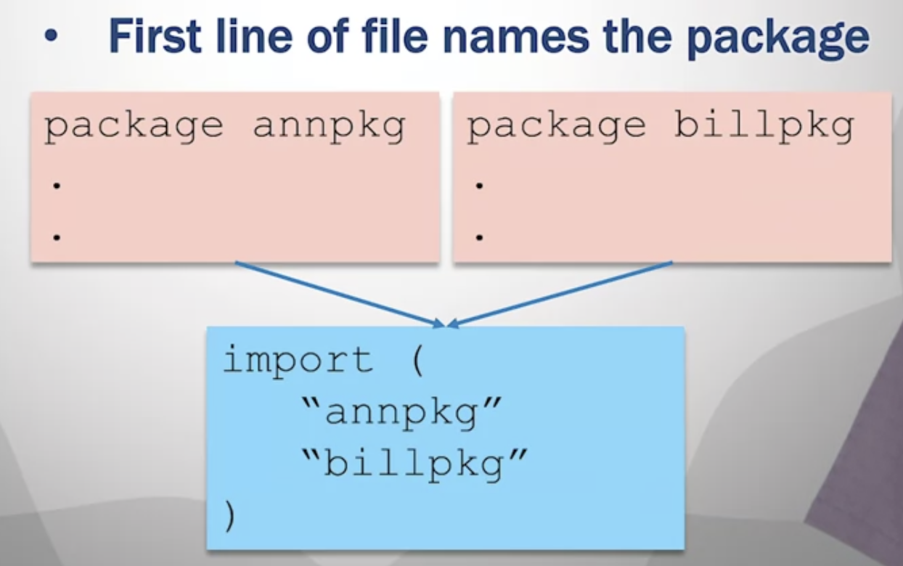
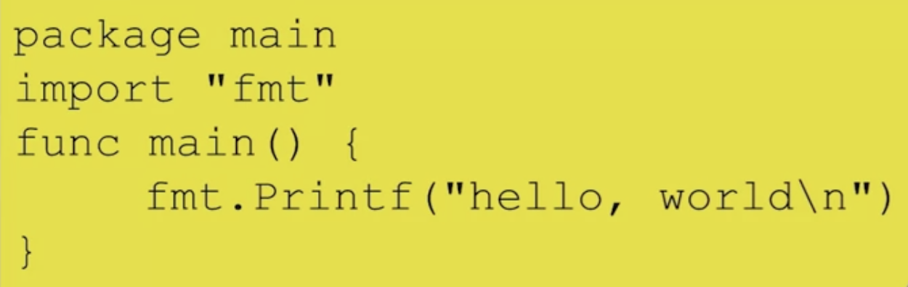
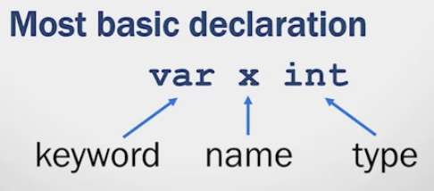

# Softwate Translation
1. Machine language
   CPU instructions represented in binary
2. Assembly language
   CPU instructions with mnemonics
3. High-level language
   C++, javaj, go...

## Compilation:
    Translate instructions once before running the code. (Only once)
## Interpretation:
    Translate instructions while code is executed. (Translation occurs every execution)
### Compiled code is fast.
### Interpreters make coding easier.

## Garbage Collection 
Go has Automatic memory management.

----
# Object
Object-Oriented Programming.\
Go don't use term class.\
Go use structs with associated methods.\
Different with other OOP.

# Concurrency
* Parallelism
* Concurrency is the management of multiple tasks at the same time.
* Key requirement for large systems.
* Concurrent programming enables parallelism.

## Concurrency in Go
* Go includes concurrency primitives
* *Goroutines* represent concurrent tasks
* *Channels* are used to communicate between tasks
* *Select* enables task synchronization
* Concurrency primitives are efficient and easy to use
  
## Workspaces
* Three subdirectories
  * src - Contains source code files
  * pkg - Contains packages(libraries)
  * bin - contains executables
* Directory hierarchy is recommended, not enforced
* 
* Package
  * 
* Package Main
  * There must be one package called <font color="red">main</font>
  * Building the main package generated an excutable program
  * Main package needss a <font color="red">main()</font>
  * <font color="mintblue">main()</font> is where code execution starts
  * 

# Import
* <font color="red">import</font>keyword is used to access other packages
* Go standard library includes many packages
  * i.e. "fmt"
* Searches directories specified by GOROOT and GOPATH

# The Go Tool
* <font color="red">go build</font> - compiles the program
  * Arguments can be a list ofpackages or a list of go files 
  * Creates an executable for the main package, same name as the first .go file
  * .exe suffix for executable in Windows

* <font color="red">go doc</font> - prints documentation for a package
* <font color="red">go fmt</font> - formats source code files
* <font color="red">go get</font> - downloads packages and install them
* <font color="red">go list</font> - lists all installed packages
* <font color="red">go run</font> - compiles .go files and runs the executable
* <font color="red">go test</font> - runs tests using files ending in "_test.go"

# Variables
* Naming
  * must be start with letter
  * case sensitive
  * dont use keywords
* All variables must have <font color="red">declarations</font>
* 
* Can declare many on the same line
  * `var x, y, int`

## Variable Types
* Integer
* Floating Point
* Strings

## Variable Initialization
* Type Declarations
  * Defining an alias for a type
  * May Improve clarity
    * `type Celsius float64`
    * `type IDnum int`
  * Can declare variables using the type alias
    * `Var temp Celsius`
    * `Var pid IDnum`
### Initializing Variables
* Initialize in the declaration
  * `var x int = 100`
  * `var x = 100`
* Initialize after the declaration
  * ```
    var x int
    x = 100
    ```
* Uninitialized variables have a zero value
  * `var x int` // x = 0
  * `var x string` // x = ""
* Short Variable Declarations
  * Can perform a declaration and initialization together withthe <font color="red">:=</font> operator
    * `x := 100`
  * Variable is declared as type of expression on the right hand side
  * <font color="red">Can only do this inside a function</font>


# Quiz
Question 2\
**What is the scope of a variable?**\
A. The variable declaration  \
B. The instructions where the variable is assigned a value\
<u>C. Region of a program where the variable can be accessed</u>\
D. The set of values to which a variable can be assigned\

