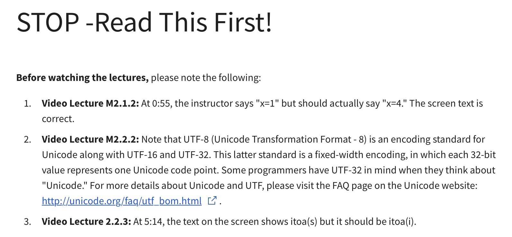
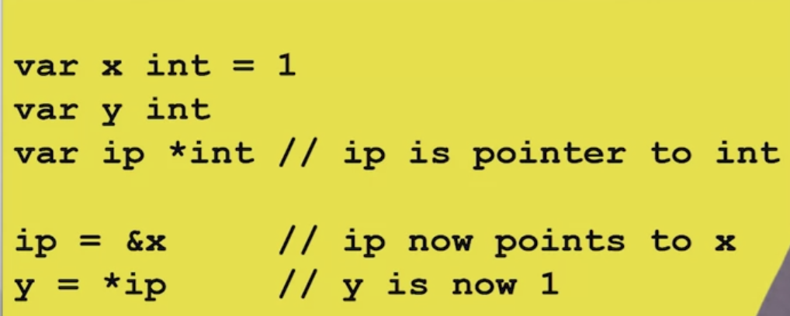
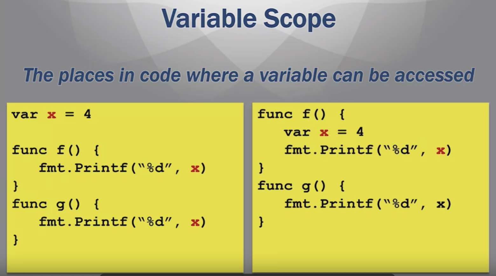
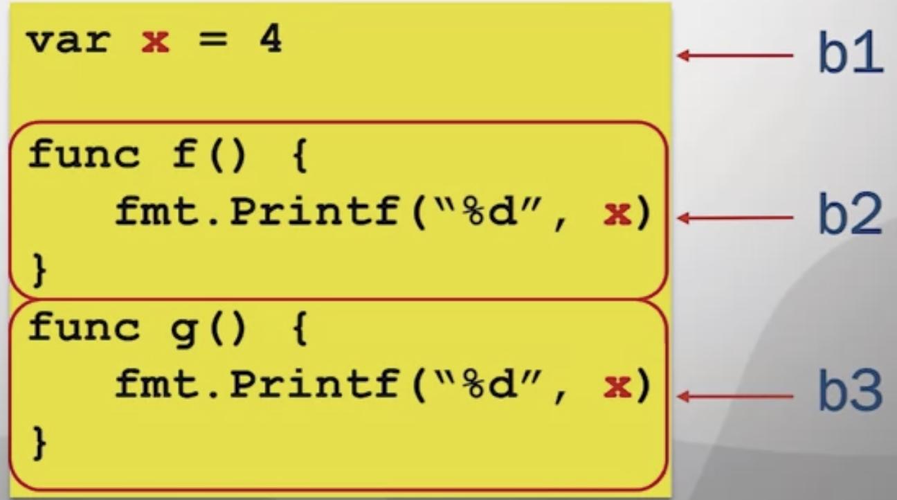
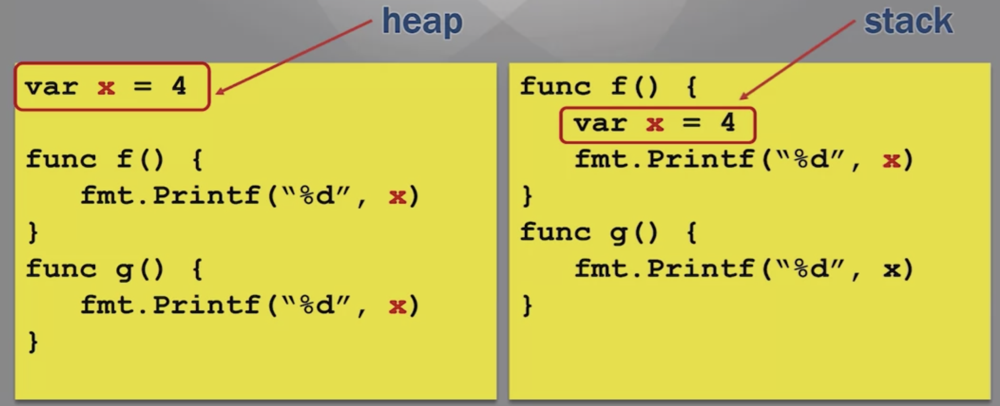
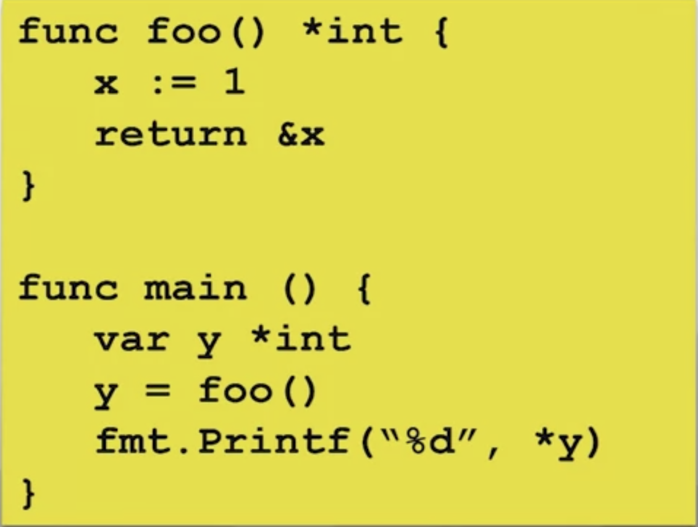
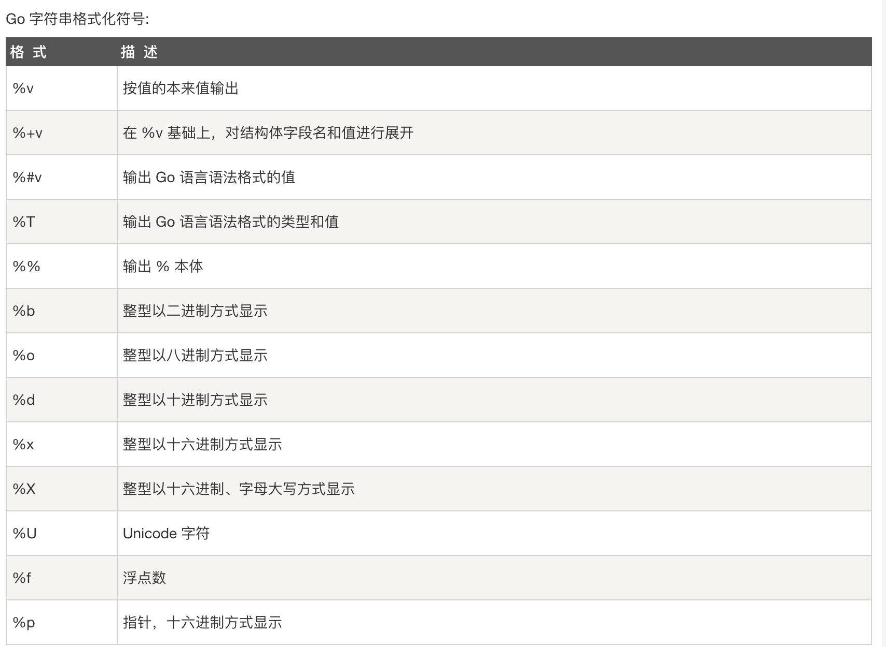
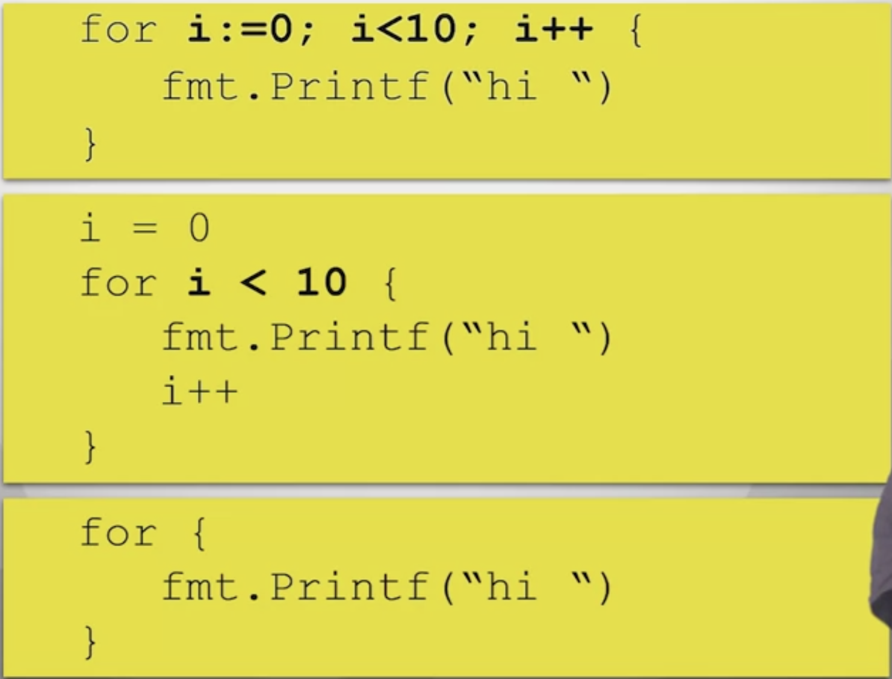
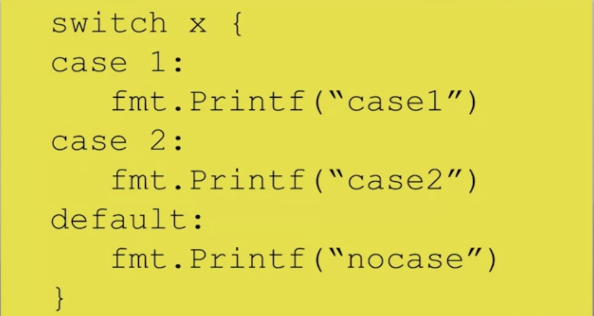
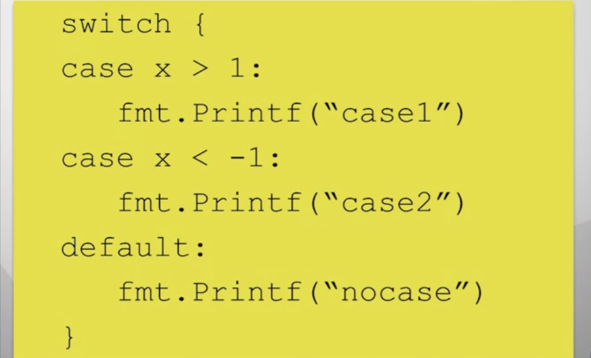

# Module 2: Basic Data Types
----

----
## Pointers
- A pointer is an address to data in memory.
- <font color="red">&</font> operator returns the address of a variable/function.
- <font color="red">*</font> rerurns data at an address (dereferencing).


## New
- Alternate way to create a variable
- <font color="red">new()</font> function creates a variable and returns a pointer to the variable
- Variable is initialized to zero
  - ```
    ptr := new(int)
    *pyr = 3
    ```
## Variable Scope
- The places in code where a variable can be accessed.
- 
### Blocks
- A sequence of declarations and statements within matching brackets,<font color="red">{}</font>
  - including function definitions
- Hierarchy of <font color="red">implicit blocks</font> also
- Universe block - all Go source
- Package block - all source in a package
- File block - all source in a file
- "if, "for", "switch" or "select" - individual clauses each get a block

### Lexical Scoping
- b<sub>i</sub> >= b<sub>j</sub> if b<sub>j</sub> is defined inside b<sub>i</sub>   &emsp;&emsp;&emsp;    (b -->  block)
  - "defined inside" is reansitive
  - 

### Scope of Variables
- Variable accessible from block b<sub>j</sub> if:
  - 1. Variable is declared in block b<sub>i</sub>, and
  - 2. b<sub>i</sub> >= b<sub>j</sub>

## Deallocating Memory
### Deallocating Space
- When a variable is no longer needed, it should be <font color="red">deallocated</font>
  - Memory space is made available
- Otherwise, we will eventually run out of memory
  - ```
    func f() {
        var x = 4
        fmt.Printf("%d",x)
    }
    ```
- Each call f() creates an integer
  
### Stack vs. Heap

- Stack is dedicated to function calls
  - Local variables are stored here
  - Deallocated after function completes
- Heap is persistent

### Manual Deallocation
- Data on the heap must bedeallocated when it is done beingused
- In most compiled languages (i.e. C),this is done manually
  - ```
    x = malloc (32) ;
    free (x) ;
    ```
- Error-prone, but fast


## Garbage Collection
### Pointers and Deallocation
- Hard to determine when a variable isno longer in use
  -    
  - only legal in GO
- foo() returns pointer to x

### Garbage Coloection
- In interpreted languages, this is done by <font color="red">the interpreter</font> 
  - Java Virtual Machine
  - Python Interpreter
- Easy for the programmer
- Slow (need an Interpreter)

### Garbage Collection in Go
- Go is a compiled language whichenables garbage collection
- Implementation is fast
- Compiler determines stack vs heap
- Garbage collection in the background


## Comments, Printing, Integers
### Comments
- Comments are text forunderstandability• 
- Ignored by the compiler• 
- Single-line comments
  - `// This is a comment`
  - `var & int // Another comment`
- Block comments
  - ```
    /* Comment1
       Comment2 */
    var x int
    ```

### Printing
- Import from the fmt package
- <font color="red">fmt.Printf()</font> (fmt.Println) prints a string
  - ```
    fmt.Printf("Hi")
    x := "Joe"
    fmt.Printf("Hi" + x)
    ```
- Format strings are good for formatting
- Conversion characters for each argument
  - `fmt.Printf("Hi %s", x)`
- 

### Integers
- Generic int declaration
  - `vat x int`
- Different lengths and signs
  - int8, int16, int32, int64,uint8, uint16, uint32, uint64 
- Binary operators
  - Arithmetic: + - * / % << >>
  - Comparison: == != > < >= <=
  - Boolean: && ||

## Ints, Floats, Strings
### Type Conversions
- Most binary operations need operands of the same type
  - Including assignments
  - ```
    var x int32 = 1
    var y int16 = 2
    x = y     //Error
    ```
- Convert type with <font color="red">T( )</font> operation
  - `x = int32(y)`
  
### Floating Point
- `float32` - ~6 digits of precision
- `float64` - ~15 digits of precision
- Expressed using decimals orscientific notation
  - `var x float64 = 123.45`
  - `var y float64 = 1.2345e2`
- Complex numbers represented astwo floats: real and imaginary
  - `var z complex128 = complex (2,3)`

### ASCII and Unicode
- American Standard Code for Information Exchange
- Character coding - each character is associated with an (7) 8-bit number
  - > 'A' = 0x41
- <font color="red">Unicode</font> is a 32-bit character code
- <font color="red">UTF-8</font> is variable length
  - 8-bit UTF codes are same as ASCII
- <font color="red">Code points</font> - Unicode characters
- <font color="red">Rune</font> - a code point in Go
  
### Strings
- Sequence of arbitrary bytes
  - Read-only
  - Often meant to be printed
- String Literal - notated by double quotes
  - `x := "Hi there"`
- Each byte is a rune (UTF-8 code point)

## String Packages
### Unicode Package
- Runes are divided into many different categories
- Provides a set of functions to test categories of runes
  - `IsDigit(r rune)`
  - `IsSpace(r rune)`
  - `IsLetter(r rune)`
  - `IsLower(r rune)`
  - `IsPunct(r rune)`
- Some functions perform conversions
  - `ToUpper (r rune)`
  - `ToLower (r rune)`
- Functions to manipulate UTF-8 encoded strings
- String search functions
  - <font color="red">Compare(a, b)</font> - returns an integer comparing two strings lexicographically. 0 if a==b, -1 if a < b,and +1 if a > b.
  - <font color="red">Contains(s, substr)</font> - returns true if substring is inside s
  - <font color="red">HasPrefix(s, prefix)</font> - returns true is the string s begins with prefix
  - <font color="red">HasSuffix(s, suffix)</font> - returns true is the string s end with suffix

### String Manipulation
- Strings are immutable, but modifiedstrings are returned
- <font color="red">*Replace (s, old, new, n)*</font> - replace returns a copy of the string swith the first n instances of oldreplaced by new
- <font color="red">*ToLower(s)*</font> // return new string
- <font color="red">*ToUpper(s)*</font> // return new string
- <font color="red">*TrimSpace(s)*</font> - returns a new string with all leading and trailing white space removed


### Strconv Package
- Conversions to and from stringrepresentations of basic data types
- <font color="red">*Atoi(s)*</font> - converts string to int
- <font color="red">*Itoa(i)*</font> - converts int(base 10) to string
- <font color="red">*FormatFloat (f, fmt, prec, bitSize)*</font> - converts floating point number to a string
- <font color="red">*ParseFloat (s, bitsize)*</font> - Converts a string to a floating point number
  
## Constants
- Expression whose value is known at compile time
- Type is inferred from righthand side (boolean, string, number)
  - ```
    const x = 1.3
    const (
        y =4
        z = "Hi"
    )
    ```
### iota
- Generate a set of related but distinct constants
- Often represents a property which has several distinct possible values
  - Days of the week
  - Months of the year
- Constants must be different but <font color="red">actual value is not important</font>
- Like an enumerated type in other languages
- Iota Example
  - ```
    type Grades int
    const (
        A Grades = iota
        B
        C
        D
        F
    )
    ```
  - Each constant is assigned to a unique integer
  - Starts at 1 and increments 


## Control Flow
### Control Structures
- Statements which alter control flow
  - ```
    if <condition> {
        <consequent>
    }
    ```
- Expression `<condition>` is evaluated
- `<consequent>` statements are executed if condition is `true`
  ```
  if x > 5 {
    fmt.Printf("Yup")
  }
  ```
- 

### For Loops
- Lterates while a conditon is true
- May have an initialization and update operation
  - ```
    for <int>; <cond>; <update> {
        <stmts>
    }
    ```


### Switch/Case
- <font color="red">Switch</font> is a multi-way if statement
- Switch may contain a <font color="red">tag</font> which is a variable to be checked 
- Tag is compared to a constant defined in each <font color="red">case</font>
- Case which matches tag is executed

  - while automatic break


## Conrtrol Flow, Scan
### Tagless Switch
- Switch may not contain a tag
- Case contains a boolean expression to evaluate
- First true case is executed
- 

### Break and Continue
- <font color="red">Break</font> exits the containing loop
    ```
    i := 0
    for i < 10 {
        i++
        if i == 5 { break }
        fmt.Printf("hi ")
    }
    ```
- <font color="red">Continue</font> skips the rest of the current iteration
    ```
    i := 0
    for i < 10 {
        i++
        if i == 5 { continue }
        fmt.Printf("hi ")
    }
    ```

### Scan
- Scan reads user input
- Takes a pointer as in argument
- Typed data is written to pointer
- Returns number of scanned items
  ```
  var appleNum int

  fmt.Printf("Number of apples?")
  num, err :=
  fmt.Sacn(&appleNum)
  fmt.Printf(appleNum)

