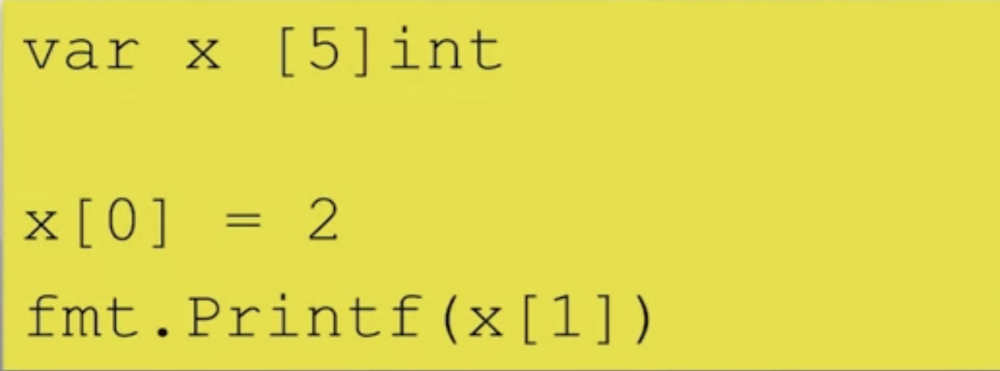
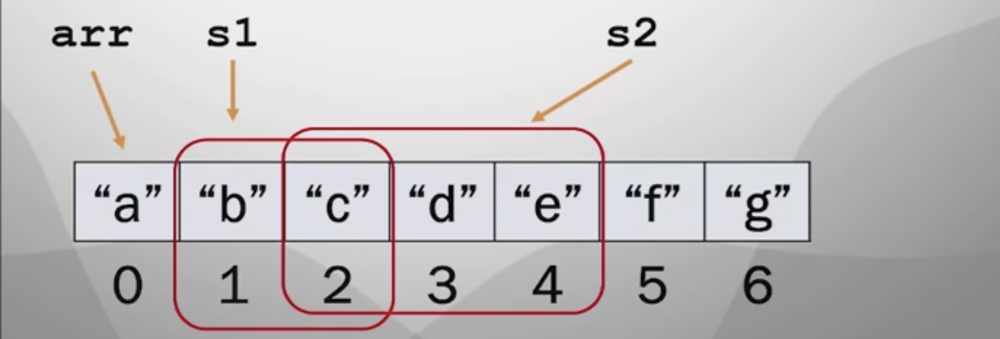
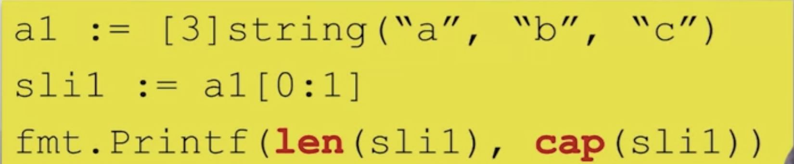
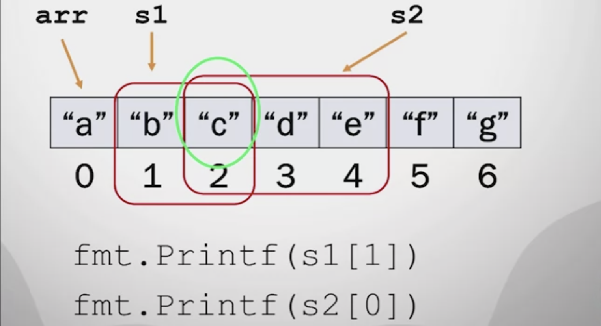
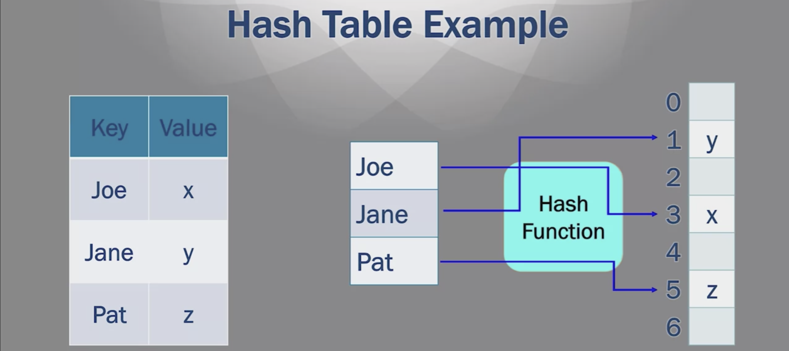
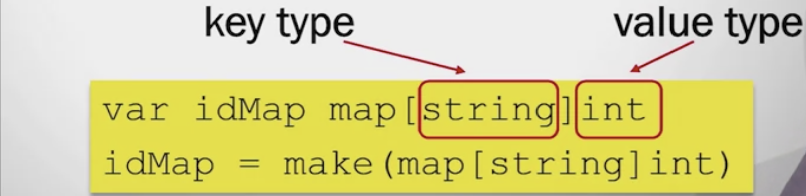
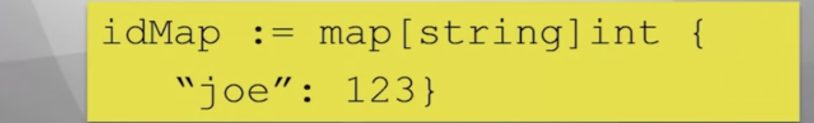
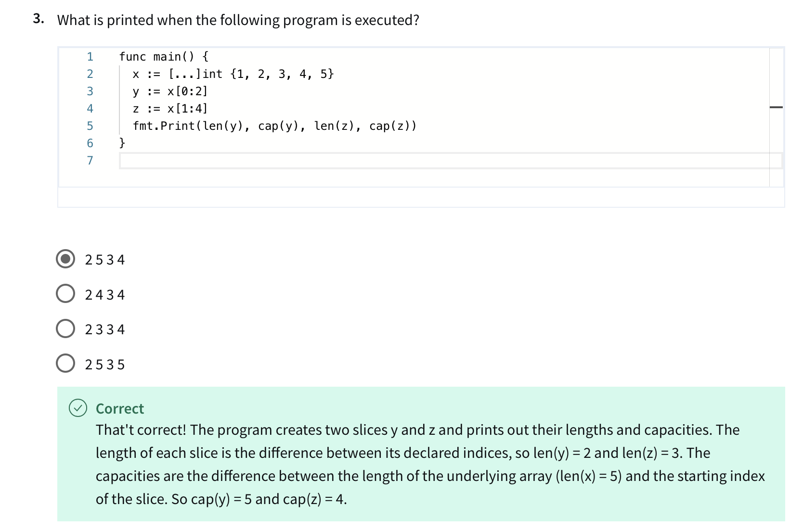
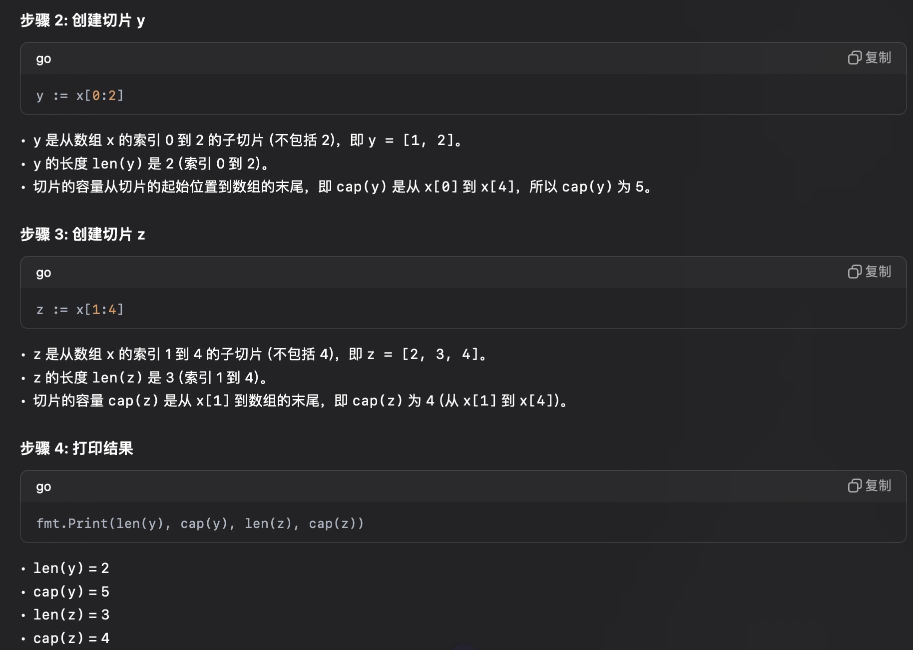

# Composite Data Types
## Arrays
- Fixed-length series of elements of a chosen type
- Elements acessed using subscript notation, [ ]
- Indices start at 0
- Elements initialized to zero value


### Array Literal
- An array pre-defined with values
- ```
    var x [5]int = [5]{1, 2, 3, 4, 5}
  ```
- Length of literal must be length of array
- <font color="red">...</font> for size in array literal infers size from number of initializers
- ```
    x := [...]int{1, 2, 3, 4, 5}
  ```
### Iterating Through Arrays
- Use a for loop with the <font color="red">range</font> keyword
- ```
    x := [3]int {1, 2, 3}

    for i,v range x {
        fmt.Printf("ind %d, val %d", i, v)
    }
  ```
- Range returns two values
- Index and element at index


## Slices
- A 'window' on an  <font color="red">underlying array</font>
- Variable size, up to the whole array
- <font color="red">*Pointer*</font> indicates the start of the slice
- <font color="red">*Length*</font> is the number of elts in the slice
- <font color="red">*Capacity*</font> is maximum number of elts
  - From start of slice to end of array
### Slices Examples
```
    arr := [...] string{"a", "b", "c", "d", "e", "f", "g"}
    s1 := arr[1:3]
    s2 := arr[2:5]
``` 


### Length and Capacity
- <font color="red">len()</font> function returns the length
- <font color="red">cap()</font> function returns the capacity

- Result is "<font color="red"> 1 3 </font>"

### Accessing Slices
- Writing to a slice changes underlying array
- Overlapping slices refer to the same array elements


### Slice Literals
- Can be used to initialize a slice
- Creates the underlying array and creates a slice to reference it
- Slice points to the start of the array, length is capacity


## Variable Slices
### Make
- Create a slice (and array) using <font color="red">make()</font>
- 2-argument version: specify type and length/capacity
- Init. to zero, length = capacity
  - ``` sli = make ([]int, 10)```
- 3-argument version: specify length and capacity separately
  - ``` sli = make ([]int, 10, 15)```

### Append
- Size of a slice can be increased by <font color="red">append ()</font>
- Adds elements to the end of a slice
- Inserts into underlying array
- Increases size of array if necessary
  - ``` sli = make ([]int, 0, 3)```
- Length of sli is 0
  - ``` sli = append (sli, 100) ```


## Hash Table
- Contains key/value pairs
  - SSN/email
  - GPS cords/address
- Each value is associated with a unique key
- <font color="red">Hash function</font> is used to compute the slot for a key


### Tradeoffs of Hash Tables
#### Advantages
- Faster lookup than lists
  - Constant-time, vs. linear-time
- Arbitrary keys
  - Not ints, like slices or arrays
#### Disadvantages
- May have collisions
  - Two keys hash to same slot


## Maps
- Implementation of a hash table
- Use *make()* to create a map
- 
- May define a map literal
- 
### Accessing Maps
- Referencing a value with [key]
- Returns zero if key is not present
- ``` fmt.Println(idMap["joe"]) ```
- Adding a key/value pair
- ``` idMap["jane"] = 456 ```
- Deleting a key/value pair
- ``` delete(idMaps, "joe") ```

### Map Functions
- Two-value assignment test for existence of the key
- ``` id, p := idMap["joe"] ```
- ``` id ``` is value, ```p``` is prensence of key
- ``` len() ``` returns number values
- ``` fmt.Println(len(idMap)) ```
  
### Iterating THrough a Map
- Use a for loop with range keyword
- Two-value assignment with range
- ```
    for key, val := range idMap {
        fmt.Println(key, val)
    }
  ```

## Struct
- Aggregate data type
- Groups together other objects of arbitrary type

### *Example: Person Struct*
- Name, Address, phone
- Option 1: Have 3 separete variables, programmer remembers that they are related
- Option 2: Make a single struct which contains all 3 vars
- ```
    type struct Person {
        name string
        addr string
        phone string
    }
    var p1 Person
  ```
- Each property is a field
- ``` p1 ``` contains values for all fields

### Accessing Stuct Fields
- Use dot notation
- ```
    p1.name = "joe"
    x = p1.addr
  ```

### Initializing Structs
- Can use ``` new()```
- Initializes fields to zero
- ``` p1 := new(Person) ```
- Can initialize using a struct literal
- ``` p1 := Person(name: "joe", addr: "a st.", phone: "123")```


# Quiz

