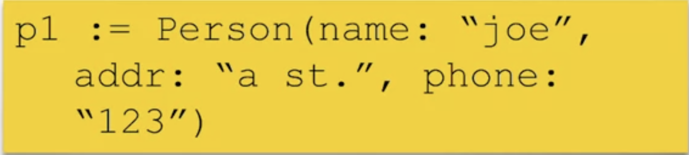
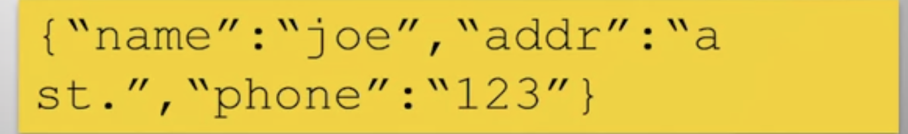
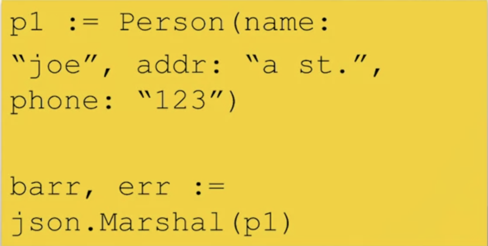
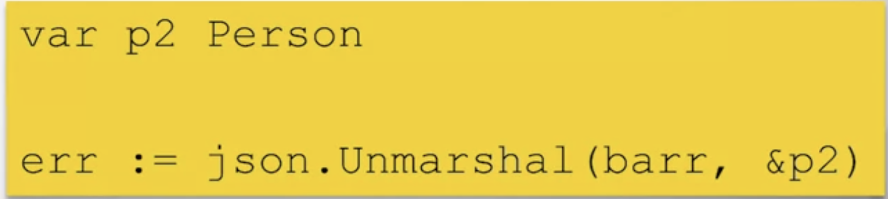
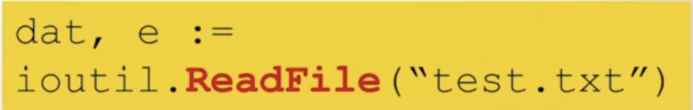
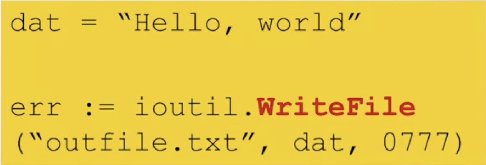
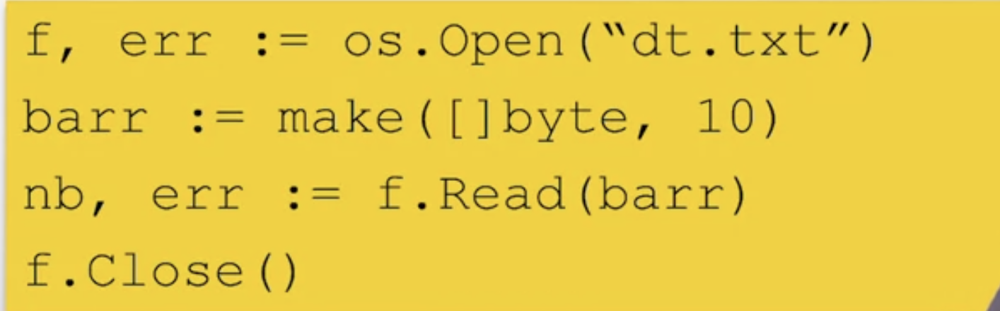
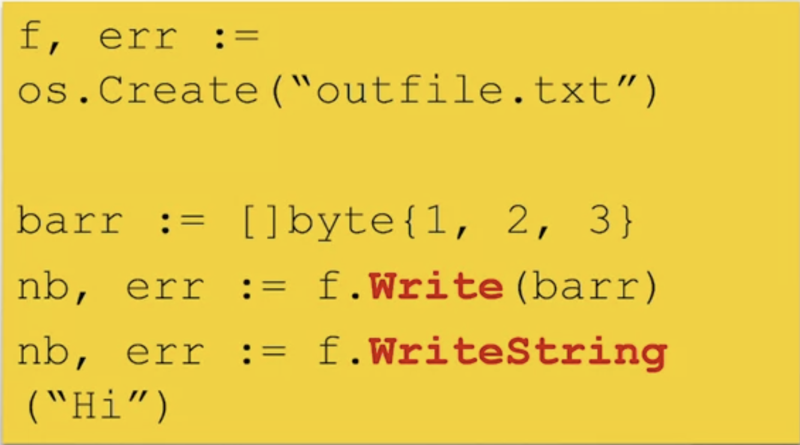

# Protocols and formats
- Rquests for Comments(RFC)
- Definitions of internet protocols and formats
- Example protocols
  - HTML - Hypertext MarkupLanguage, 1866
  - URI - Uniform Resource Identifier, 3986
  - HTTP -Hypertext Transfer Protocol, 2616
### Protocol Packages
- Golang provides packages for important RFCs
- Functions which encode and decode protocol format
- ```“net/http”```
  - Web communication protocol
  - http.Het(www.uci.edu)
- ```"net"```
  - TCP/IP and socket programming
    - net.Dial("tcp","uci.edu:80")

### JSON
- JavaScript Object Notation
- RFC 7159
- Format to represent structured information
- Attribute-value pairs
  - struct or map
- Basic value types
  - Bool. number, string, array, "object"

### JSON Example
- GO struct:
- 
- Equivalent JSON object:
- 

## JSON Properties
- All Unicode
- Human-readable
- Fairly compact representation
- Type can be combined recursively
  - Array of structs, struct in struct, ....

## JSON Marshalling
- Generating JSON representation from an object
- ```
    type Person struct {
        Name string
        Addr string
        Phone string
    }
  ```
  - <font color="red">结构体字段的首字母必须大写！！！！</font>
- 第一个括号应该是{ }，定义拍p1的时候
- <font color="red">Marshal()</font> returns JSON representation as ``` []byte ```

## JSON unmarshalling
- 
- <font color="red">Unmarshal()</font> converts a JSON []byte into a Go object
- Pointer to Go object is passed to ``` Unmarshal() ```
- Object must "fit" JSON []byte


## Files
- Linear access, not random access
  - Mechanical delay
- Basic operations
  - 1. **Open** - get handle for access
  - 2. **Read** - read bytes into []byte
  - 3. **Write** - write []byte into file
  - 4. **Close** - release handle
  - 5. **Seek** - move read/write head

### ioutil File Read
- "io/ioutil" package has basic functions
  - 
- *dat* is []byte filled with contents of entire file
- Explicit open/close are not needed
- Large files cause a problem
   
### ioutil File Write
- 
- Write []byte to file
- Creates a file
- Unix-style permission bytes

## os Package File Access
- <font color="red">os.Open()</font> opeans a file
  - Returns a file descriptor(File)
- <font color="red">os.Close()</font> close a file
- <font color="red">os.Read()</font> reads from a file into a []byte
  - Fills the []byte
  - Control the amount read
- <font color="red">os.Write()</font> Write a []byte into a file

### os File Reading
- **Opeaning and reading**
  - 
- **Reads and fills** barr
- Read **returns # of bytes read**
- May be less than []byte length

### os File Create/Write
- 
- WriteString() **writes a string**
- Write() **writes a []byte**
  - Any Umicode sequence
  

  


